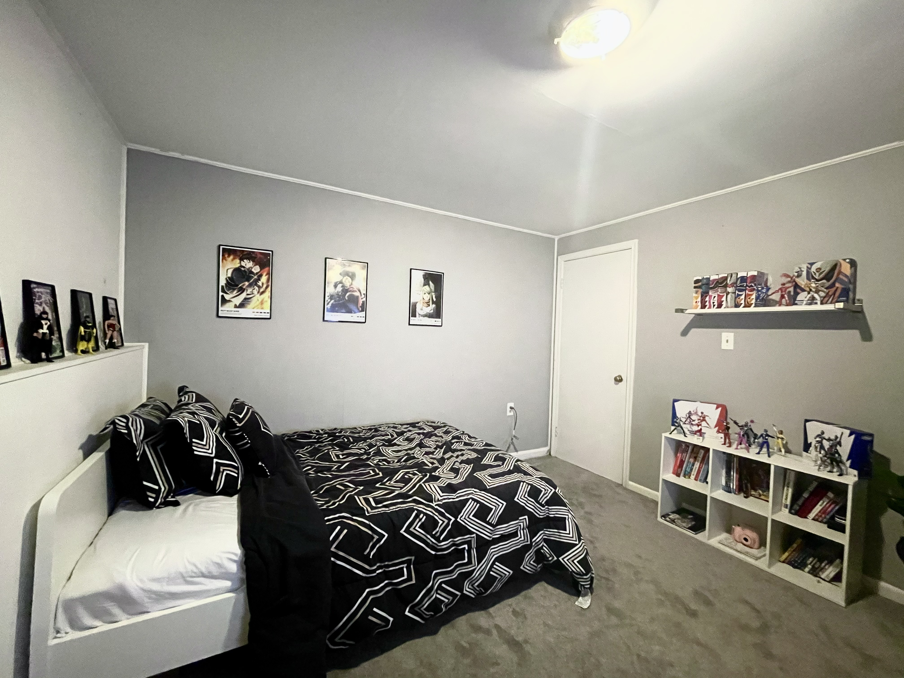
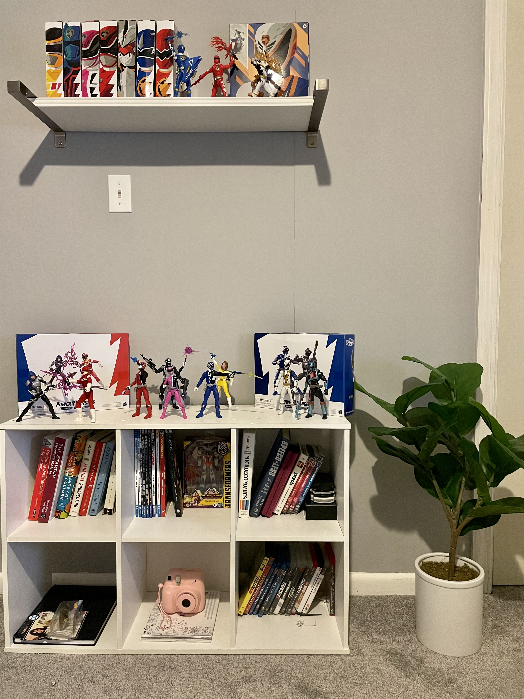
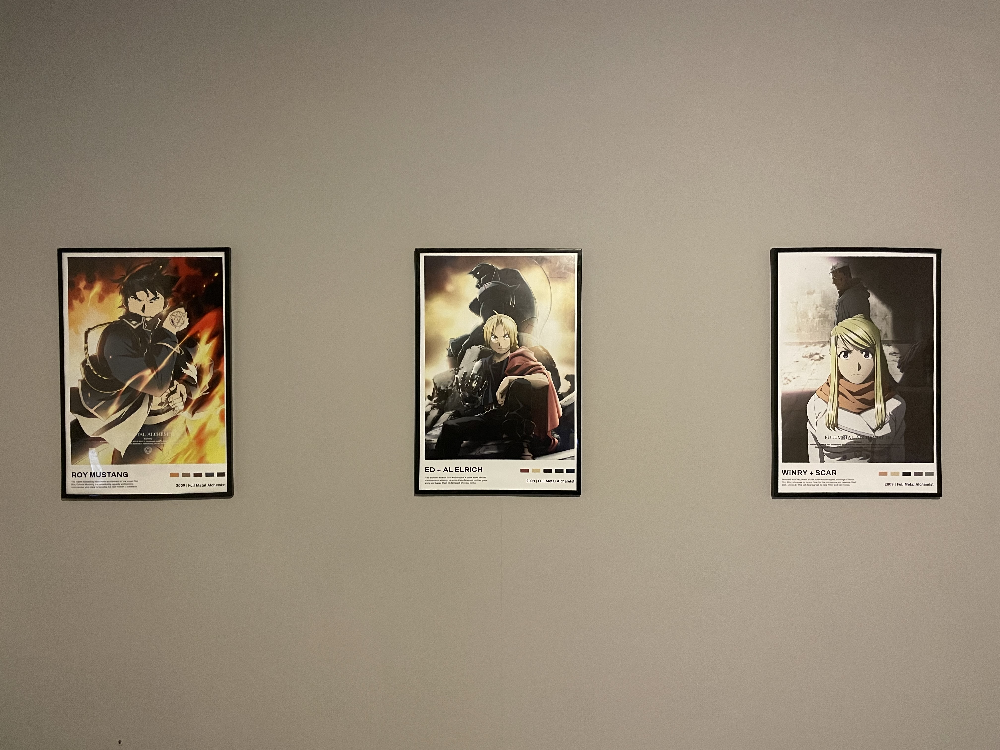
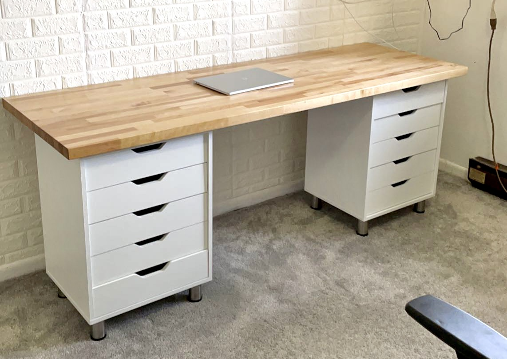
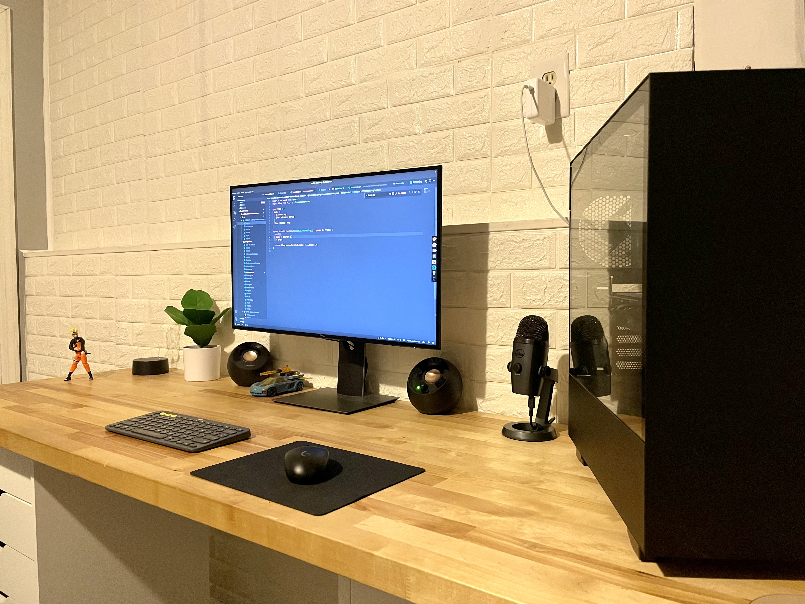
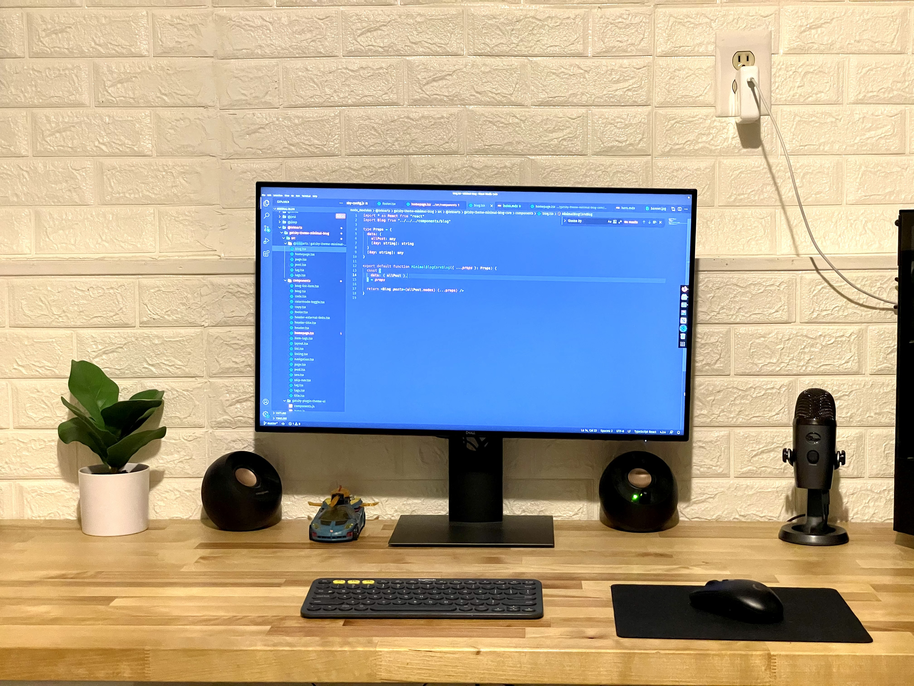
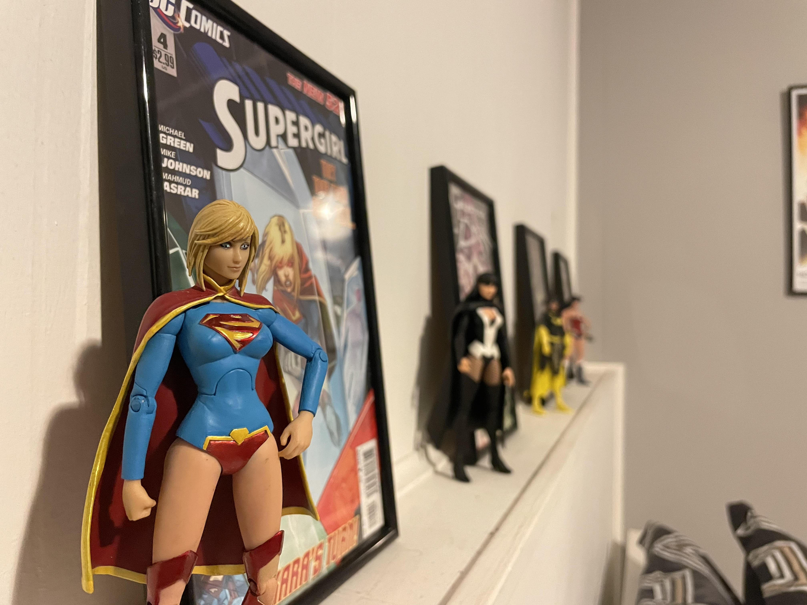
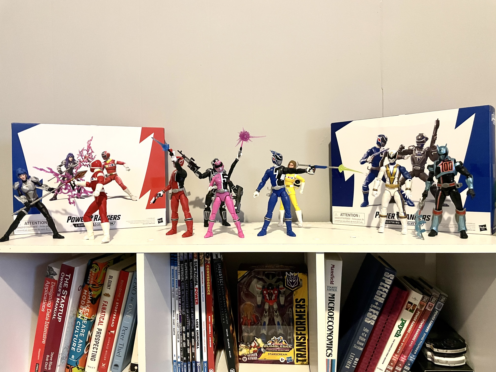
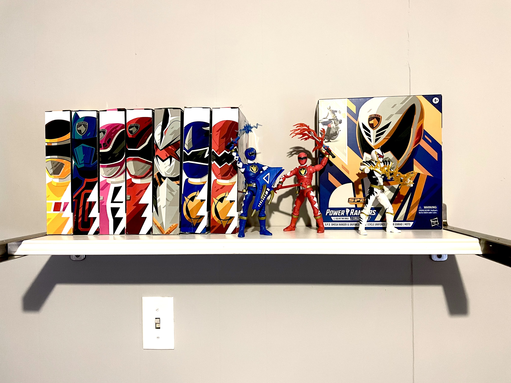

So I originally planned to write content related to startup-y business-y programmer-y stuff.

But instead my first post will  end up being one of those *lifestyle blog* posts. I know, right? 

<!--  -->

## Long overdue rennovations.
Alright look, I'm not one of those goofy looking Property Brothers, and this isn't HGTV. So, much like Quibi's lifespan we'll keep it short.

When we first moved into this place a couple years ago— there was a lot to fix and rennovate. It was a fair bit of work— but I had previous reno experience with a fixer-upper home.

Compared to that house, this place was a cakewake. It was also the first time in my life that I had my own room (and bed), which was pretty neat.

### The current situation
Flash forward two years, and one global pandemic later and I can finally say I've get my space looking like how I've always imagined. 

#### What I did:
- Painted the walls "pebble grey." There are so many greys out there. *Way too many grey variants.*
- Installed the IKEA shelf thingy— I got the wrong size brackets, but it still looks cool.
- Reorganized the action figure displays and added some fake ass plants for color.
- Touched up the door. It was previously a horrifc vomit yellow color.
- And of course, got some cool new posters.

## The Posters
You ever hang up a painting or poster and realize it didn't look right?
To avoid that scenario, I decided to simulate what the posters would look like beforehand.

### Photoshop Mockup Time, Baby!
My favorite part of designing stuff is generating the mockups in Photoshop.

I started to watch Full Metal Alchemist Brotherhood recently and fall in love with the show again.

So natrually I decided to whip up some minimalist, hipster-esque, and *totally legal* poster designs in Illustrator.
#### Here's mockup:

#### Here's the result:

Pretty damn close, right? I was curious to see if Walmart's Photo center would even print out my designs... considering they're a *ahem* *ugh, you know.*

But the whole thing went off with a hitch, and I got my prints for super cheap.

## Desk Setup
A few months ago I decided to build my own desk. It was suprsingly easy.

### Here's how it went down
- I purchased a birch butcher block from Home Depot. This thing is heavy.
- Next, I sanded it down and sealed it with polyurethane— which gives it that nice honey colored finish...and also protects the wood the from inevitable— me spilling my chai.
- Then I built those knock-off IKEA Alex drawers. It was a pain, the instructions sucked.
- I put some 4 inch risers on those bad boys, and added rupper bads on top of the drawers to prevent the table top from sliding— and voila, a custom desk.

I built a PC last year. It's currently running POP OS! and Windows 10— which I only use when I need to access the Adobe Suite... 

That little Logitech K380 keyboard is the greatest thing since Taylor Swift's Blank Space music video.

## The Figures
The action figures are living their best lives.
Check it out.

#### Supergirl (and friends)
We have the ladies of DC lined up next to their respective comic books.
All the figures here are from DC's New 52 Collection.

##### The Line Up:
- Supergirl
- Zatana 
- Batgirl
- Wonder Woman

Supergirl has always been underrated.

### The Power Rangers
A fateful visit to Target one evening introduced me to my first Power Ranger action figure, and the rest is history.

All these figures are part of Hasbro's Lightning Collection— which pays homage to Power Rangers throughout the franchise's history.
Including the iterations I grew up with!

##### Power Rangers S.P.D and In Space
Brings me back to Saturday morning cartoons.

##### Power Rangers Dino Thunder + Box Art.

Growing up, I was **obssessed** with dinosuars, lightning bolts, and Power Rangers. So suffice it to say, Power Rangers Dino Thunder was quite the hit with tiny Mo.
I love the box art for these figures, it's beautiful.

Ending these things always feels awkward. 

So instead of a proper conclusion, please accept this gif from Disney Channel's Zack and Cody.

